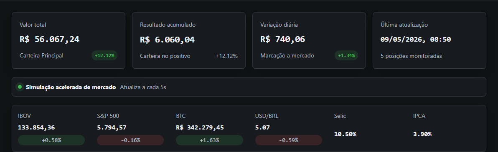
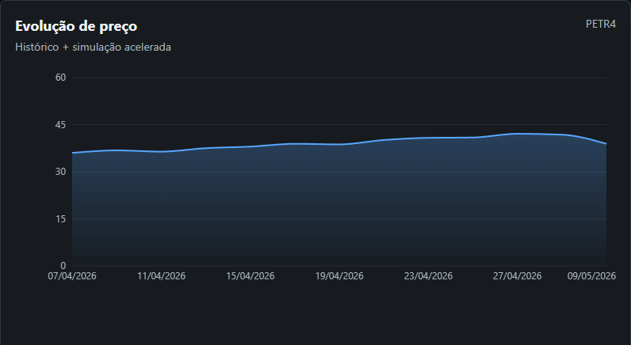
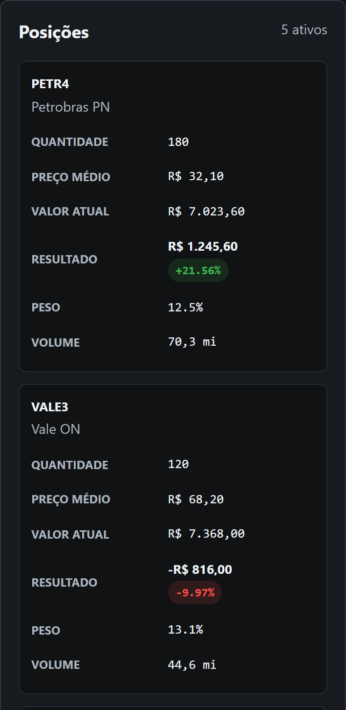

# Financial Dashboard

Dashboard financeiro construído com React, TypeScript, Redux Toolkit e Recharts. O projeto simula uma tela de home broker com carteira, indicadores, histórico de preços, alocação e envio de ordem.

Os preços usam uma simulação local acelerada: a cada poucos segundos, os valores oscilam e a carteira é recalculada. Isso mantém a demonstração viva sem depender de cadastro, chave de API ou serviço externo.

## Preview

### Resumo da carteira



### Evolução de preço



### Posições no mobile



## Objetivo

Este projeto foi pensado para demonstrar fundamentos cobrados em vagas frontend com foco em mercado financeiro:

- React com componentes reutilizáveis.
- TypeScript em modo strict.
- Redux Toolkit para estado global.
- Axios e service layer para chamadas HTTP.
- DTOs, mappers e tipos de domínio.
- Gráficos com Recharts.
- Simulação acelerada de preços com mock API.
- CSS com tokens, objetos reutilizáveis e convenção BEM.

## Como rodar

```bash
npm install
npm run dev
```

Por padrão, a aplicação usa dados mockados. Para apontar para uma API real:

```env
VITE_USE_MOCKS=false
VITE_API_BASE_URL=http://localhost:3000/api
```

Mesmo com mock, a camada de services foi mantida para facilitar a troca por uma API real no futuro.

## Responsividade

A interface foi ajustada para desktop e mobile. No desktop, a área de posições usa tabela para facilitar comparação. Em telas pequenas, essa mesma lista vira cards com rótulos por campo, evitando colunas espremidas e scroll horizontal desnecessário.

Para testar sem expor o servidor na rede:

1. Abra `http://127.0.0.1:5173` no Chrome ou Edge.
2. Pressione `F12`.
3. Ative o modo dispositivo com `Ctrl + Shift + M`.
4. Escolha um preset como iPhone, Pixel ou Galaxy.
5. Recarregue a página e valide dashboard, tabela de posições e formulário de ordem.

## Scripts

```bash
npm run dev      # servidor local Vite
npm run build    # typecheck + build de produção
npm run lint     # análise estática
npm run test     # testes unitários
```

## Estrutura

```text
src/
  components/      UI, layout, gráficos e blocos da carteira
  data/            API mockada no mesmo formato dos DTOs
  dtos/            contratos externos da API
  hooks/           hooks tipados do Redux
  mappers/         conversão DTO -> domínio
  pages/           telas roteadas
  services/        fronteira de HTTP/mock
  store/           slices e selectors
  styles/          tokens e CSS global
  types/           tipos de domínio usados pela UI
  utils/           formatadores e guards
```

## Fluxo de dados

1. A tela dispara thunks como `fetchPortfolio` e `fetchMarketSummary`.
2. Os thunks chamam services como `portfolioService`.
3. O service busca dados da API real ou da API mockada.
4. Os mappers convertem `snake_case` de DTO para `camelCase` de domínio.
5. Os slices armazenam o estado no Redux.
6. Os selectors entregam dados prontos para os componentes.

## Decisões técnicas

- Separação entre DTOs da API e tipos de domínio usados pela UI.
- Mappers para centralizar conversões e cálculos financeiros.
- Redux Toolkit para estado compartilhado entre cards, gráficos, tabela e ordens.
- Selectors memoizados para desacoplar componentes do formato interno do store.
- Mock API para permitir demonstração sem backend e facilitar a troca por API real.
